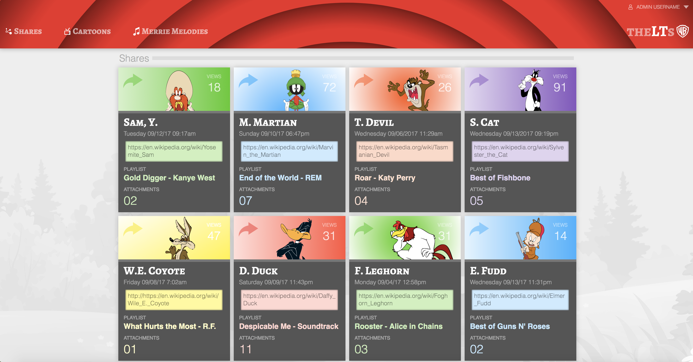

Static Comp 2 - Rob Morgan

This is a static composition built for Turing School of Software & Design.  The goal was to improve design/HTML/CSS skills.  It is designed to work on all screen sizes.

Live version: https://rmorgan323.github.io/rm-comp-challenge-2/

My primary goal with this static comp was solid functionality on all screen sizes.  So I began with making sure the cards filled a smaller mobile screen (320px wide) with just a small margin.  I ended up with a width of 304px for each card.  Then I used flexbox to position them up to 4 wide, depending on screen width.

Using the `flex-wrap` property, allowed me to keep the bottom row to the left.  To center the all the content, I defined a width of the card container box and set margin to auto.  I think the results turned out nicely.

The design is tested on Chrome, Firefox, and Safari, on all screen widths.  A few things rendered differently on Firefox and had to be tweaked, mainly with the body background image.  Also, the text inside the link boxes on the cards was different on Firefox and was changed to make sure it worked.

For the design, I chose Looney Toons characters, and used bright colors.  It's a busier design than I would normally create, but is intentionally so, due to the frenetic, colorful, and fast-paced show that Merrie Melodies was. A plain, clean page, with loads of white space, in my opinion, wouldn't fit the subject matter.

********

Finished Product

